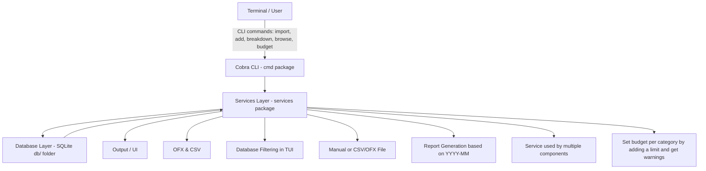

# Project: Personal Finance CLI Manager

## Description

This project represents a command-line tool for tracking personal income and expenses. Import transactions from
bank statements, categorize them automatically, set budgets, and generate insightful reports—
all from your terminal.

## User Stories

| Feature / User Story | Status |
|---------------------|--------|
| As a user, I can import transactions from CSV/OFX files | ✅ |
| As a user, I can manually add income and expenses | ✅ |
| As a user, I can categorize transactions automatically | ✅ |
| As a user, I can set budgets per category and get alerts | ✅ |
| As a user, I can generate reports (monthly spending, category breakdown) | ✅ |
| As a user, I can search and filter transactions | ✅ |

## Usage

Available commands:

| Command | Description
|---------|------------
| `atad-cli import <file>` | Imports a CSV/OFX(XML FORMAT) file and displays the output formatted as a table.
| `atad-cli add file/f <file>` | Imports the CSV/OFX(XML FORMAT) file, adds the content to the database and displays the database content as a table.
| `atad-cli add manual/m <date> <amount> <description>` | Manually add income/expense.
| `atad-cli budget <category> <limit>` | Use the category and limit amount to set a budget for that category. The alerts will be checked immediately and it can be either OK or >=90% WARNING or >=100% ALERT.
| `atad-cli report <YYYY-MM>` | Create a day-by-day graphical report based on the year and month given in the format YYYY-MM.
| `atad-cli breakdown <YYYY-MM>` | Create a monthly breakdown report to see spending on categories based on the year and month given in the format YYYY-MM.
| `atad-cli browse` | Launch an interactive TUI to browse transactions with 3 filtering options: 1=YYYY-MM, 2=Description, 3=Category.

**Categorization is done automatically based on regex expressions found in Models/rules.go such as:** 
**"Groceries": regexp.MustCompile(`(?i)(kaufland|carrefour|lidl|profi|mega|supermarket|walmart|tesco|sainsbury|asda|aldi|grocery|market|food\sstore)`)**

## System Architecture

cmd/ -> commands folder
├── root.go -> main command of CLI app, used to init and load all subcmds
├── add.go -> command used to add expenses, either manually or imported from csv/ofx
├── import.go -> command used to import expenses from a csv/ofx format
├── browse.go -> command used to filter and view the expenses db content from a TUI with 3 filtering options
├── breakdown.go -> command used to generate a monthly breakdown report based on a YYYY-MM input date format
└── budget.go -> command used to limit the budget per categories and get warnings when its over 90% and alerts over 100%

db/ -> local db folder
└── atad_project.db -> local sql db to store expenses under the format: transactions (date, amount, description, category) and budget limits under the format: budgets (category, budget_limit)

models/ -> models folder
├── budget.go -> budget struct containing the id, category and limit
├── rules.go -> ruleset map used for auto-categorization based on regex, used on description to filter to right category e.g Pets:(pet|vet|veterinary|dog|cat|petfood|grooming|petshop)
└── transaction.go -> transaction struct used for CSV/OFX manipulation containing date, amount, description, category

services/ -> services folder, actual implementation of services used in commands
├── service-breakdown.go -> breakdown command implementation based on a visual representation of each category spending from a given month, in ASCII format using █ character
├── service-browse.go -> browse command implementation, focused on using the bubbletea & lipgloss libraries for the implementation, based on 3 filters: category, description, year-month
├── service-budget.go -> budget command implementation, focused on SQL operations to generate alerts/warnings if needed
├── service-cli-utils.go -> service created to contain multiple functionalities for multiple other services, currently containing a prettyprint function that used tablewriter library to display a table nicely
├── service-db.go -> service used for db manipulation for operations such as adding transactions, setting budget limits, printing all db entries etc
├── service-import-csv.go -> import command implementation for CSV files using gocsv library
├── service-import-ofx.go -> import command implementation for OFX files in an XML format
└── service-report.go -> report command implementation, focused on using the asciigraph library to graphicaly represent a monthly spending report

README.md -> readme file
go.mod -> project dependencies
go.sum -> check integrity of project dependencies
main.go -> application entry point, launches cmd.execute() to start from root.go
test.csv -> file used to test import csv implementation
test.ofx -> file used to test import ofx implementation

