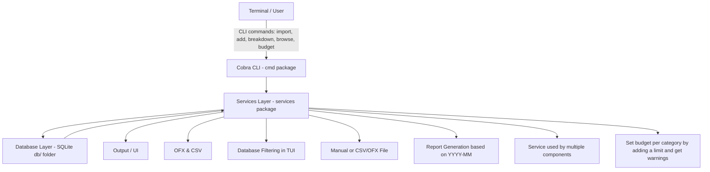

# Project: Personal Finance CLI Manager

## Description

This project represents a command-line tool for tracking personal income and expenses. Import transactions from
bank statements, categorize them automatically, set budgets, and generate insightful reports—
all from your terminal.

## User Stories

| Feature / User Story | Status |
|---------------------|--------|
| As a user, I can import transactions from CSV/OFX files | ✅ |
| As a user, I can manually add income and expenses | ✅ |
| As a user, I can categorize transactions automatically | ✅ |
| As a user, I can set budgets per category and get alerts | ✅ |
| As a user, I can generate reports (monthly spending, category breakdown) | ✅ |
| As a user, I can search and filter transactions | ✅ |

## Usage

Available commands:

| Command | Description
|---------|------------
| `atad-cli import <file>` | Imports a CSV/OFX(XML FORMAT) file and displays the output formatted as a table.
| `atad-cli add file/f <file>` | Imports the CSV/OFX(XML FORMAT) file, adds the content to the database and displays the database content as a table.
| `atad-cli add manual/m <date> <amount> <description>` | Manually add income/expense.
| `atad-cli budget <category> <limit>` | Use the category and limit amount to set a budget for that category. The alerts will be checked immediately and it can be either OK or >=90% WARNING or >=100% ALERT.
| `atad-cli report <YYYY-MM>` | Create a day-by-day graphical report based on the year and month given in the format YYYY-MM.
| `atad-cli breakdown <YYYY-MM>` | Create a monthly breakdown report with the year and month in the format YYYY-MM.
| `atad-cli browse` | Launch an interactive TUI to browse transactions with 3 filtering options: 1=YYYY-MM, 2=Description, 3=Category.

**Categorization is done automatically based on regex expressions found in Models/rules.go such as:** 
**"Groceries": regexp.MustCompile(`(?i)(kaufland|carrefour|lidl|profi|mega|supermarket|walmart|tesco|sainsbury|asda|aldi|grocery|market|food\sstore)`)**

## System Architecture

