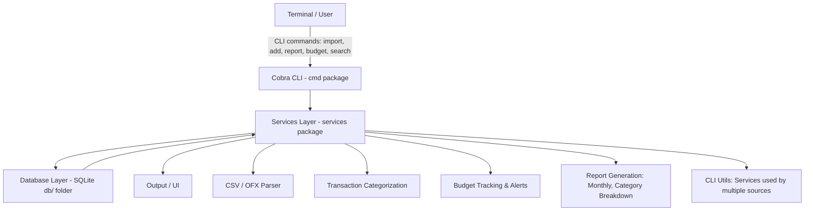

# Project: Personal Finance CLI Manager

## Description

This project represents a command-line tool for tracking personal income and expenses. Import transactions from
bank statements, categorize them automatically, set budgets, and generate insightful reports—
all from your terminal.

## User Stories

| Feature / User Story | Status |
|---------------------|--------|
| As a user, I can import transactions from CSV/OFX files | ✅ |
| As a user, I can manually add income and expenses | ✅ |
| As a user, I can categorize transactions automatically | ✅ |
| As a user, I can set budgets per category and get alerts | ✅ |
| As a user, I can generate reports (monthly spending, category breakdown) | ✅ |
| As a user, I can search and filter transactions | ✅ |

## Usage

Available commands:

| Command | Description
|---------|------------
| `atad-cli import <file>` | Imports a CSV/OFX(XML FORMAT) file and displays the output formatted as a table.
| `atad-cli add file/f <file>` | Imports the CSV/OFX(XML FORMAT) file, adds the content to the database and displays the database content as a table.
| `atad-cli add manual/m <date> <amount> <description>` | Manually add income/expense.
| `atad-cli budget <category> <limit>` | Use the category and limit amount to set a budget for that category. The alerts will be checked immediately and it can be either OK or >=90% WARNING or >=100% ALERT.
| `atad-cli breakdown <YYYY-MM>` | Create a monthly breakdown report with the year and month in the format YYYY-MM.
| `atad-cli browse` | Launch an interactive TUI to browse transactions with 3 filtering options: 1=YYYY-MM, 2=Description, 3=Category.

**Note: in order for the atad-cli command to actually work do go build -o atad-cli.exe main.go and add it to PATH**

**Note2: maybe the display from add command should be removed due to the size of the DB bcs if the db is big it will confuse the user by having a big table in the cmd line**

## System Architecture

**Note: architecture might change in the future due to implementation of new features**

**Note2: i KNOW uploading the db is not the way it's just for testing purposes at the moment**

**Note3: the db right now has DATE as TEXT format might/should change it in the future**

